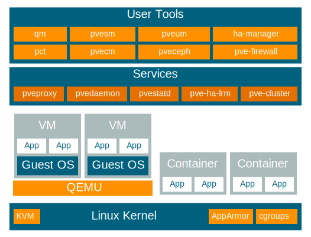

## Presentazione di Proxmox

> **HPE Engineer**
>> Alessandro Moriondo
   
1. cosa fa 
   - hypervisor virtual machine stack kvm/qemu
   - container management lxc
2. licensig
   - soluzione onpensource
   - pagamento del supporto per subscrition per socket
3. modalità di configurazioni
   - 2 nodi computazionali + 1 per management (backup server)
   - 3 nodi integrato con ceph (software defined storage)
   - stretched cluster con lvm sharedcross dc con fc san

### 1. Cosa fa

E' un hypervisor basato sul sistema operativo linux debian ed utilizza come stack KVM che è il modulo kernel principale su linux per la virtualizzazione hardware e Qemu come stack applicativo per l'emulazione. Il nome della soluzione è **Proxmox VE**.

Supporta inoltre lo stack LXC per l'esecuzione di container linux

Supporta l'hardware x86:
- intel vt-x
- amd-v

**Schema blocchi delle funzionalità e di tutti i servizi della soluzione proxmox VE**

#### 1.1 Deploy e Management

E' installabile direttametne bare metal sulle macchine tramite una iso scaricabile direttamente dal sito del produttore. Una volta installato e configurata la rete di management l'host è gestibile tramite interfaccia web

> L'interfaccia web può gestire il singolo nodo ma anche l'interno cluster o datacenter, percui non c'è bisogno di effettuare il deploy di una appliance di gestione (esempio vcenter per vsphere), ma già ogni console web di ogni singolo nodo del cluster può nativamente gestire l'intera infrastruttura. In questo modo si ha già una ridondanza di management

Supporta la completa gestione del cluster anche tramite CLI e tramite Restful API per l'automazione delle attività